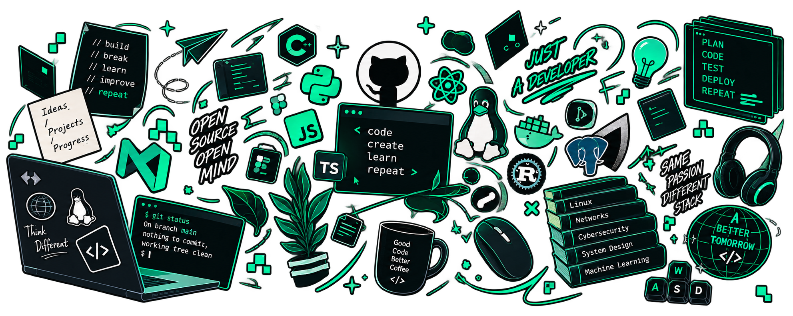
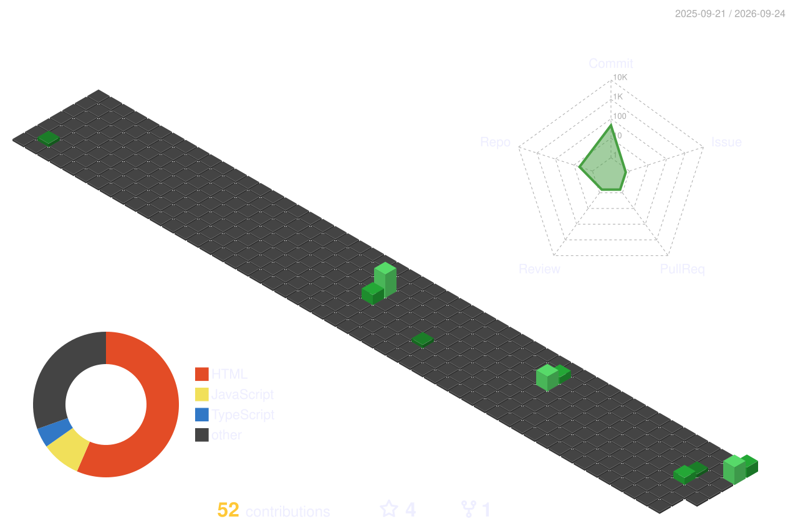

  

  

## Tools and Technologies

  

 

  <!-- Core Languages -->
  
  
  
  
  

  <!-- Frontend -->
  
  
  
  
  

  <!-- Backend & APIs -->
  
  
  

  <!-- AI / ML / CV -->
  
  
  
  
  
  

  <!-- Tools, DevOps & Hardware -->
  
  
  
  
  

 
<h3 align="center">CURRENT STATS</h3>
 

  
  

 

  

 

  
  &nbsp;
  
  &nbsp;
  
  &nbsp;
  

